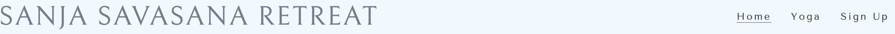

# SANJA SAVASANA RETREAT

The Sanja Savasana Retreat (SSR) website is a luxury yoga getaway retreat set in Worthersee, Austria. It is aimed at yoga enthusiasts who would like to get away and relax whilst able to do some yoga in one of the most peaceful and beautiful parts of the world. All abilities and ages are welcome. 

The users of this website will be able to find the information they need to know about SSR: About SSR, where it is located, what is provided, the types of yoga on offer, a sign-up form and links to SSR social media platforms.

## Features

Navigation

-	Featured at the top of the page, the navigation shows the company name in the left-hand corner: Sanja Savasana Retreat that links to the index.html.
-	The other navigation links are to the right: Home, Yoga, Sign Up which link up the separate pages.
-	The navigation links to the right have a hover function and when clicked on has an underline to display which page you are on.
-	The navigation shows the user the company name clearly and where to find the required information easily.

Social Media Icon Links

-	Featured at the bottom of the page, the icons show the user what social media presence the company has.
-	Each icon opens a new tab directly to that platform.
-	The icons have a more rounded look due to it being a yoga website, therefore looking more peaceful and relaxing.

