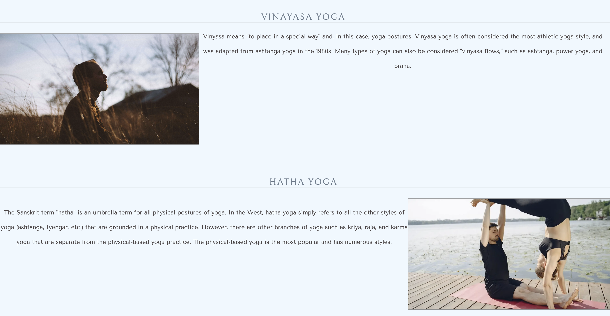

# SANJA SAVASANA RETREAT

The Sanja Savasana Retreat (SSR) website is a luxury yoga getaway retreat set in Worthersee, Austria. It is aimed at yoga enthusiasts who would like to get away and relax whilst able to do some yoga in one of the most peaceful and beautiful parts of the world. All abilities and ages are welcome. 

The users of this website will be able to find the information they need to know about SSR: About SSR, where it is located, what is provided, the types of yoga on offer, a sign-up form and links to SSR social media platforms.

# Features

### Navigation

-	Featured at the top of the page, the navigation shows the company name in the left-hand corner: Sanja Savasana Retreat that links to the index.html.
-	The other navigation links are to the right: Home, Yoga, Sign Up which link up the separate pages.
-	The navigation links to the right have a hover function and when clicked on has an underline to display which page you are on.
-	The navigation shows the user the company name clearly and where to find the required information easily.
-	The company name uses a font that is soft and clean. The company name also uses colour that is not to strong but easily clear against the background.
-	Navigation links to the right use more of a free spirted font. The colour is darker to make it clear these are the navigation links. 

### Social Media Icon Links

-	Featured at the bottom of the page, the icons show the user what social media presence the company has.
-	Each icon opens a new tab directly to that platform.
-	The icons have a more rounded look due to it being a yoga website, therefore looking more peaceful and relaxing.
-	The icons colour gives it a softer approach.

### Home Header

-	The hero image is bright and crisp giving the user an idea of the surroundings they will be practicing yoga and relaxing in.
-	The cover text establishes what type of retreat this is and the location of the retreat.
-	The colour of the box and font makes it clearer for the user to read, there is extra shadow to emphasise this further.   

### Home Content

-	The h2 elements are in the centre with a crisp line underneath across the page to separate the sections to keep it clear to read.
-	The use of the two different font colours and styles are to keep in the theme of the Company and page. 

### Yoga Header

-	The hero image is not as bright as the home page as it gives a more of a meditation feel especially with the woman doing the tree pose in the image.
-	The tree pose is not particularly difficult but doing it on the edge of a boat can be. The reason for choosing this picture is to show that the retreat incorporates all abilities.
-	A change to the cover text to allow the user to know that they are on the right page.

### Yoga Content

-	The images were chosen to show the variety on offer and the different areas that the user could be doing yoga.
-	The font style and colours are the same as the home page. 

### Sign Up Header

-	The hero image is of the lake and retreat at night-time. This is to clarify to the user that they are on the final page.
-	A change to the cover text to thank the user for signing up and just visiting the web site.

### Sign Up Form 

-	The start of the form has a brief explanation of what is required from the sign-up form and a small thank you to the user.
-	The font style and colours are in keeping of the website.

-	The form is broken up into sections to keep it clear for the parts the user has done.
-	The user is required to enter their name and email in the form. There is also placeholder text to make what type of information is required from the user.
-	For the gender section there is a drop-down with options to make it more convenient for the user.
-	In your experience section and about your stay section there are radio checks so that the user can only choose one and if they do not choose an option the form will automatically choose the first option.
-	In the about your stay section there is also a text area for the user to write any other requirements needed.
-	The final part of the form is a large submit button that will take the user to the confirmation page.

### Confirmation Page

-	Brief message to inform the user that the form has been submitted and that they will be directed back to the homepage. This will automatically occur in 10 seconds. 

# Future Features

### Gallery Page

-	Add a Gallery Page to give the user an impression of what our social media content might include and maybe entice the user to follow us on social media. 

### Booking Form

-	Makes it easier for the user to reserve places at the Retreat.

# Testing

# Code Validation

### HTML

| Page | W3C URL | Screenshot | Notes |
| --- | --- | --- | --- |
| Home | [W3C](https://validator.w3.org/nu/?doc=https%3A%2F%2FStocks84.github.io%2FSanja-Savasana-Retreat%2Findex.html) |  | Pass: No Errors |
| Yoga | [W3C](https://validator.w3.org/nu/?doc=https%3A%2F%2FStocks84.github.io%2FSanja-Savasana-Retreat%2Fcontact.html) |  | End tag had attributes. Stray end tag and fixed |
| Sign Up | [W3C](https://validator.w3.org/nu/?doc=https%3A%2F%2FStocks84.github.io%2FSanja-Savasana-Retreat%2Fquiz.html) |  | Section lacks heading and fixed |

### CSS

I have used the recommended [CSS Jigsaw Validator](https://jigsaw.w3.org/css-validator) to validate all of my CSS files.

| File | Jigsaw URL | Screenshot | Notes |
| --- | --- | --- | --- |
| style.css | [Jigsaw](https://jigsaw.w3.org/css-validator/validator?uri=https%3A%2F%2FStocks84.github.io%2FSanja-Savasana-Retreat) |  | Pass: No Errors |

# Browser Compatibility

I've tested my deployed project on multiple browsers to check for compatibility issues.

| Browser | Screenshot | Notes |
| --- | --- | --- |
| Chrome |  | Works as expected |
| Firefox |  | Works as expected |
| Safari |  | Works as expected |

# Responsiveness

I've tested my deployed project on multiple devices to check for responsiveness issues.

| Device | Screenshot | Notes |
| --- | --- | --- |
| Mobile (DevTools) |  | Works as expected |
| Tablet (DevTools) |  | Works as expected |
| Desktop |  | Works as expected |

# Lighthouse Audit

I've tested my deployed project using the Lighthouse Audit tool to check for any major issues.

| Page | Size | Screenshot | Notes |
| --- | --- | --- | --- |
| Home | Mobile |  | Slow response time due to large hero image. Minor foregound & background colour contrast issue. Few warnings |
| Home | Desktop |  | Slow response time due to large hero image. Minor foregound & background colour contrast issue. Few warnings|
| Yoga | Mobile |  | Slow response time due to large images. Minor foregound & background colour contrast issue. Few warnings |
| Yoga | Desktop |  | Slow response time due to large images. Minor foregound & background colour contrast issue. Few warnings |
| Sign Up | Mobile |  | Slow response time due to large hero image. Minor foregound & background colour contrast issue. Few warnings |
| Sign Up | Desktop |  | Slow response time due to large hero image. Minor foregound & background colour contrast issue. Few warnings |

# Bugs

### GitHub **Issues**

- Commit messages:
    - At the beginning forgot the captial letters at the start.
    - Due to habit referred to some commits in past tense.
    - With a few commits especially the taks commit, were forced errors due to internet issues whilst i was at work, deployed.
    
    
    

# Unfixed Bugs

- There are no remaining bugs that I am aware of.

# Deployment

The site was deployed to GitHub Pages. The steps to deploy are as follows:
- In the [GitHub repository](https://github.com/Stocks84/Sanja-Savasana-Retreat), navigate to the Settings tab 
- From the source section drop-down menu, select the **Main** Branch, then click "Save".
- The page will be automatically refreshed with a detailed ribbon display to indicate the successful deployment.

The live link can be found [here](https://stocks84.github.io/Sanja-Savasana-Retreat)

# Credits

### Content

| Source | Location | Notes |
| --- | --- | --- |
| [Chris Beams](https://chris.beams.io/posts/git-commit) | version control | "How to Write a Git Commit Message" |
| [GitHub](https://docs.github.com/en/get-started/writing-on-github/getting-started-with-writing-and-formatting-on-github/basic-writing-and-formatting-syntax) | version control | syntax |
| [W3Schools](https://www.w3schools.com/css/css3_borders.asp) | sign up page | borders |
| [W3Schools](https://www.w3schools.com/css/css3_buttons.asp) | sign up page | buttons |
| [LogRocket](https://blog.logrocket.com/how-to-style-forms-with-css-a-beginners-guide/) | sign up page | How to style forms |
| [Flexbox Froggy](https://flexboxfroggy.com/) | entire site | modern responsive layouts |
| [Grid Garden](https://cssgridgarden.com) | entire site | modern responsive layouts |
| [Wikipedia](https://en.wikipedia.org/wiki/W%C3%B6rthersee) | homepage | information about Worthersee |
| [Mindbodygreen](https://www.mindbodygreen.com/) | yoga page | types of yoga content |

### Media

| Source | Location | Type | Notes |
| --- | --- | --- | --- |
| [Pexels](https://www.pexels.com) | entire site | images | hero image backgrounds on all pages |
| [Pexels](https://www.pexels.com) | yoga page | images | yoga images throughout page |
| [Color-hex](https://www.color-hex.com/color/f5f5f5) | entire site | font colours | used to find font colours |
| [FontAwesome](https://fontawesome.com/) | entire site | icons | icons for social media navigation |
| [TinyPNG](https://tinypng.com) | entire site | image | tool for image compression |

### Acknowledgements

- In no particular order i would like to thank my Code Institute mentor, [Tim Nelson](https://github.com/TravelTimN) for his support throughout the development of this project.
- I would like to thank the [Code Institute](https://codeinstitute.net) tutor team for their assistance with troubleshooting and helping with any questions i had.
- I would like to thank the [Code Institute Slack community](https://code-institute-room.slack.com) for the moral support and quick information.
- I would like to thank my partner Sanja, for believing in me, being my muse and keeping me motivated.
- I would like to thank my family, for helping me through some of the language due to my learning difficulties.